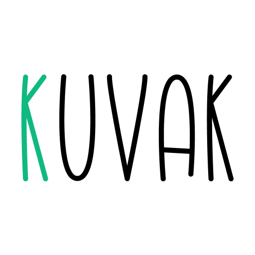

  

<h1 align="center">
  KUVAK
</h1>

  KUVAK is tiny open-source screenshot maker

  
   

<h2>
  What is the purpose of KUVAK?
</h2>

KUVAK is designed to demonstrate various aspects of a project, from feature development to testing.

<h2>
  How to use KUVAK?
  </h2>

  Upload an image and start tweaking the settings to see the changes in real-time, when you are satisfied with the result, you can download the image by clicking on the <kbd>Export</kbd> button

<h2>
License
</h2>

  KUVAK is licensed under the MIT License, see the <a href="./LICENSE.md">LICENSE.md</a> file for more information.

